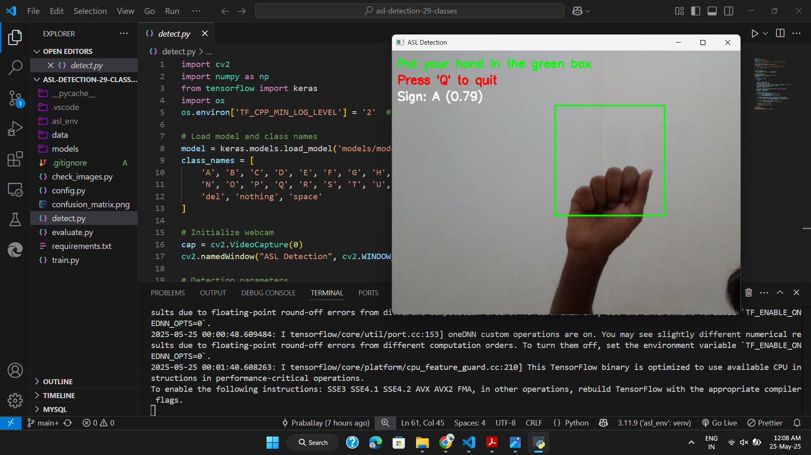
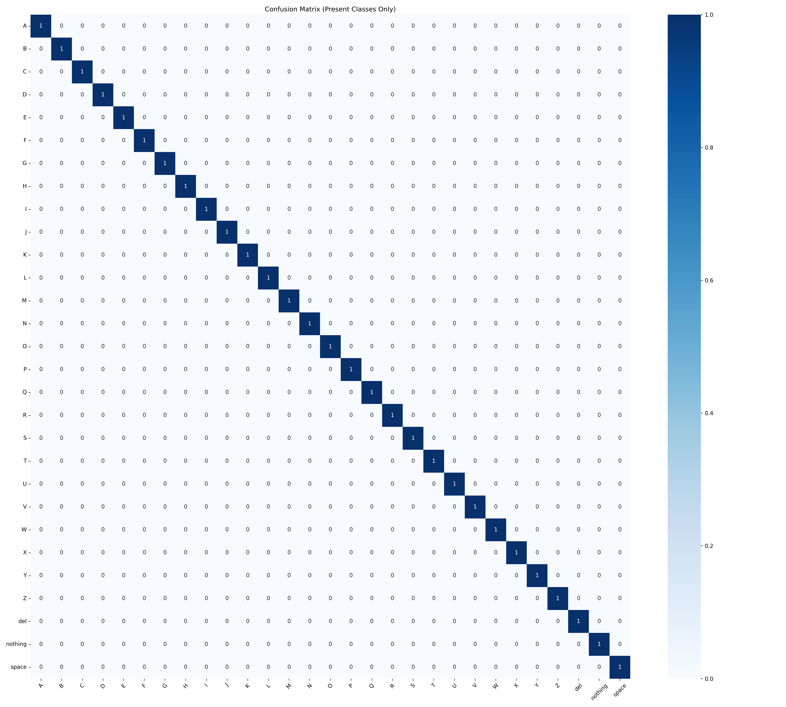
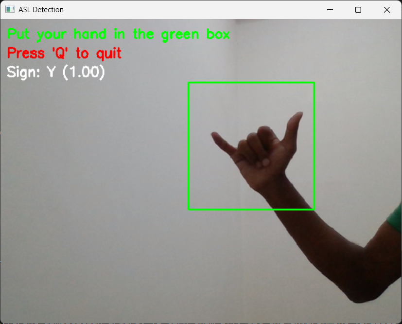

<h1 align="center">🖐️ ASL Detection System (29 Classes)</h1>
<p align="center">
  <b>A real-time deep learning-based American Sign Language (ASL) recognition system.</b><br>
  <i>Detects and classifies 29 ASL alphabet signs (A-Z, SPACE, DEL, NOTHING) from images or webcam input.</i>
</p>

<p align="center">
  
  
  
  
</p>

---

## 🚀 Overview

**ASL Detection System** is a robust, easy-to-use tool for recognizing all 26 ASL alphabets plus SPACE, DEL, and NOTHING gestures. Featuring real-time detection, high accuracy, and a user-friendly interface.

---

## 📑 Table of Contents

1. [Features](#-features)
2. [Demo](#-demo)
3. [Installation](#️-installation)
4. [Requirements](#️-requirements)
5. [Quick Start](#-quick-start)
6. [Usage](#-usage)
7. [Project Structure](#-project-structure)
8. [Training the Model](#-training-the-model)
9. [Evaluation](#-evaluation)
10. [Dataset](#-dataset)
11. [Contributing](#-contributing)
12. [Acknowledgements](#-acknowledgements)
13. [Live Demo](#-live-demo)
14. [License](#-license)
15. [Troubleshooting](#️-troubleshooting)
16. [Credits](#-credits)
17. [Contact / Support](#-contact--support)

---

## ✨ Features

- 🔤 **Recognizes all ASL alphabets (A-Z) plus SPACE, DEL, and NOTHING**
- 🎥 **Real-time webcam and image input support**
- 💯 **State-of-the-art test accuracy**
- 🖼️ **Confusion matrix visualization**
- 🛠️ **Easy-to-use scripts for training, detection, and evaluation**

---

## 🎥 Demo

<p align="center">
  
  
</p>

> 🎬 **[Live Demo](https://PrabalJay.github.io/asl-detection-29-classes)** — Try it in your browser!

---

## ⚙️ Installation

**Prerequisites:**  
- Python 3.8+  
- NVIDIA GPU (recommended for training)

**Install dependencies:**
```bash
pip install -r requirements.txt
```

---

## ⚙️ Requirements

- Python 3.8+
- TensorFlow 2.x
- OpenCV
- NumPy
- Matplotlib
- scikit-learn

---

## 🏁 Quick Start

```bash
# 1. Clone the repository
git clone https://github.com/PrabalJay/asl-detection-29-classes.git
cd asl-detection-29-classes

# 2. Install dependencies
pip install -r requirements.txt

# 3. Train the model
python train.py

# 4. Evaluate the model
python evaluate.py

# 5. Run real-time detection
python detect.py
```

---

## 💡 Usage

- **Train the Model:**  
  `python train.py`  
  _Trains the ASL recognition model using the dataset in `data/train/`_

- **Evaluate the Model:**  
  `python evaluate.py`  
  _Evaluates the trained model and generates a confusion matrix_

- **Real-Time Detection:**  
  `python detect.py`  
  _Launches webcam-based or image-based ASL detection_

- **Check Dataset Images:**  
  `python check_images.py`  
  _Verifies and cleans dataset images_

- **Configuration:**  
  `python config.py`  
  _Adjusts configuration settings for training and detection_

<summary>Examples</summary>

**Detect ASL in an Image**
```bash
python detect.py
# Example output:
# Predicted: Sign Y (1.00)
```

**Real-time Webcam Detection**
```bash
python detect.py --webcam
# (Press 'Q' to quit)
```


</details>

---

## 📁 Project Structure

```
asl-detection-29-classes/
├── data/
│   ├── train/         # Training images
│   └── test/          # Test images
├── models/
│   └── model.keras    # Trained model
├── check_images.py    # Dataset verification utility
├── config.py          # Configuration script
├── detect.py          # Real-time/image detection script
├── evaluate.py        # Model evaluation script
├── train.py           # Model training script
├── requirements.txt   # Python dependencies
├── confusion_matrix.png # Model performance visualization
└── README.md
```

---

## 🎯 Training the Model

Organize your dataset as follows:

```
data/train/
  ├── A/     # Images for 'A'
  ├── B/
  └── ... (all 29 classes)
```

Train:
```bash
python train.py
```
- Saves best model to `models/model.keras`
- Generates `confusion_matrix.png`

---

## 📊 Evaluation

Evaluate the model:
```bash
python evaluate.py
```
_Sample output:_
```
Test Accuracy: 96.3%
Class-wise Precision:
A: 0.98 | B: 0.95 | ...
```

---

## 📂 Dataset

- **Source:** [ASL Alphabet Dataset on Kaggle](https://www.kaggle.com/datasets/grassknoted/asl-alphabet)
- **Requirements:**  
  - 3,000+ images  
  - ~100 images per class  
  - PNG/JPG format

---

## 🤝 Contributing

Contributions, issues, and feature requests are welcome!  
Feel free to [fork](https://github.com/PrabalJay/asl-detection-29-classes/fork) the repo and submit a pull request.

---

## 🙏 Acknowledgements

- [TensorFlow](https://www.tensorflow.org/) — Deep learning framework
- [OpenCV](https://opencv.org/) — Computer vision library
- [ASL Alphabet Dataset](https://www.kaggle.com/datasets/grassknoted/asl-alphabet) — Dataset used for training and testing
- [scikit-learn](https://scikit-learn.org/) — Evaluation and metrics
- [Matplotlib](https://matplotlib.org/) — Visualization

Special thanks to the open-source community and contributors for their resources and support.

---

## 🟢 Live Demo  

[**Try it here**](https://PrabalJay.github.io/asl-detection-29-classes)

---

## 📜 License

MIT License — See [LICENSE](LICENSE) for details.

---

## 🛠️ Troubleshooting

| Issue                | Solution                                      |
|----------------------|-----------------------------------------------|
| CUDA errors          | Install correct TensorFlow-GPU                |
| Missing dependencies | Run `pip install -r requirements.txt`         |
| Low accuracy         | Increase epochs or add more training data      |

---

## 🙌 Credits

Built with TensorFlow/Keras

---

## 📬 Contact / Support

For questions, open an [issue](https://github.com/PrabalJay/asl-detection-29-classes/issues) or contact [PrabalJay](mailto:2k23.cs2313758@gmail.com).

---

<h1 align="center">🖐️ ASL Detection System (29 Classes)</h1>
<p align="center">
  <b>A real-time deep learning-based American Sign Language (ASL) recognition system.</b><br>
  <i>Detects and classifies 29 ASL alphabet signs (A-Z, SPACE, DEL, NOTHING) from images or webcam input.</i>
</p>

<p align="center">
  
  
  
  
</p>

---

## 🚀 Overview

**ASL Detection System** is a robust, easy-to-use tool for recognizing all 26 ASL alphabets plus SPACE, DEL, and NOTHING gestures. Featuring real-time detection, high accuracy, and a user-friendly interface.

---

## 📑 Table of Contents

1. [Features](#-features)
2. [Demo](#-demo)
3. [Installation](#️-installation)
4. [Requirements](#️-requirements)
5. [Quick Start](#-quick-start)
6. [Usage](#-usage)
7. [Project Structure](#-project-structure)
8. [Training the Model](#-training-the-model)
9. [Evaluation](#-evaluation)
10. [Dataset](#-dataset)
11. [Contributing](#-contributing)
12. [Acknowledgements](#-acknowledgements)
13. [Live Demo](#-live-demo)
14. [License](#-license)
15. [Troubleshooting](#️-troubleshooting)
16. [Credits](#-credits)
17. [Contact / Support](#-contact--support)

---

## ✨ Features

- 🔤 **Recognizes all ASL alphabets (A-Z) plus SPACE, DEL, and NOTHING**
- 🎥 **Real-time webcam and image input support**
- 💯 **State-of-the-art test accuracy**
- 🖼️ **Confusion matrix visualization**
- 🛠️ **Easy-to-use scripts for training, detection, and evaluation**

---

## 🎥 Demo

<p align="center">
  
  
</p>

> 🎬 **[Live Demo](https://PrabalJay.github.io/asl-detection-29-classes)** — Try it in your browser!

---

## ⚙️ Installation

**Prerequisites:**  
- Python 3.8+  
- NVIDIA GPU (recommended for training)

**Install dependencies:**
```bash
pip install -r requirements.txt
```

---

## ⚙️ Requirements

- Python 3.8+
- TensorFlow 2.x
- OpenCV
- NumPy
- Matplotlib
- scikit-learn

---

## 🏁 Quick Start

```bash
# 1. Clone the repository
git clone https://github.com/PrabalJay/asl-detection-29-classes.git
cd asl-detection-29-classes

# 2. Install dependencies
pip install -r requirements.txt

# 3. Train the model
python train.py

# 4. Evaluate the model
python evaluate.py

# 5. Run real-time detection
python detect.py
```

---

## 💡 Usage

- **Train the Model:**  
  `python train.py`  
  _Trains the ASL recognition model using the dataset in `data/train/`_

- **Evaluate the Model:**  
  `python evaluate.py`  
  _Evaluates the trained model and generates a confusion matrix_

- **Real-Time Detection:**  
  `python detect.py`  
  _Launches webcam-based or image-based ASL detection_

- **Check Dataset Images:**  
  `python check_images.py`  
  _Verifies and cleans dataset images_

- **Configuration:**  
  `python config.py`  
  _Adjusts configuration settings for training and detection_

<summary>Examples</summary>

**Detect ASL in an Image**
```bash
python detect.py
# Example output:
# Predicted: Sign Y (1.00)
```

**Real-time Webcam Detection**
```bash
python detect.py --webcam
# (Press 'Q' to quit)
```


</details>

---

## 📁 Project Structure

```
asl-detection-29-classes/
├── data/
│   ├── train/         # Training images
│   └── test/          # Test images
├── models/
│   └── model.keras    # Trained model
├── check_images.py    # Dataset verification utility
├── config.py          # Configuration script
├── detect.py          # Real-time/image detection script
├── evaluate.py        # Model evaluation script
├── train.py           # Model training script
├── requirements.txt   # Python dependencies
├── confusion_matrix.png # Model performance visualization
└── README.md
```

---

## 🎯 Training the Model

Organize your dataset as follows:

```
data/train/
  ├── A/     # Images for 'A'
  ├── B/
  └── ... (all 29 classes)
```

Train:
```bash
python train.py
```
- Saves best model to `models/model.keras`
- Generates `confusion_matrix.png`

---

## 📊 Evaluation

Evaluate the model:
```bash
python evaluate.py
```
_Sample output:_
```
Test Accuracy: 96.3%
Class-wise Precision:
A: 0.98 | B: 0.95 | ...
```

---

## 📂 Dataset

- **Source:** [ASL Alphabet Dataset on Kaggle](https://www.kaggle.com/datasets/grassknoted/asl-alphabet)
- **Requirements:**  
  - 3,000+ images  
  - ~100 images per class  
  - PNG/JPG format

---

## 🤝 Contributing

Contributions, issues, and feature requests are welcome!  
Feel free to [fork](https://github.com/PrabalJay/asl-detection-29-classes/fork) the repo and submit a pull request.

---

## 🙏 Acknowledgements

- [TensorFlow](https://www.tensorflow.org/) — Deep learning framework
- [OpenCV](https://opencv.org/) — Computer vision library
- [ASL Alphabet Dataset](https://www.kaggle.com/datasets/grassknoted/asl-alphabet) — Dataset used for training and testing
- [scikit-learn](https://scikit-learn.org/) — Evaluation and metrics
- [Matplotlib](https://matplotlib.org/) — Visualization

Special thanks to the open-source community and contributors for their resources and support.

---

## 🟢 Live Demo  

[**Try it here**](https://PrabalJay.github.io/asl-detection-29-classes)

---

## 📜 License

MIT License — See [LICENSE](LICENSE) for details.

---

## 🛠️ Troubleshooting

| Issue                | Solution                                      |
|----------------------|-----------------------------------------------|
| CUDA errors          | Install correct TensorFlow-GPU                |
| Missing dependencies | Run `pip install -r requirements.txt`         |
| Low accuracy         | Increase epochs or add more training data      |

---

## 🙌 Credits

Built with TensorFlow/Keras

---

## 📬 Contact / Support

For questions, open an [issue](https://github.com/PrabalJay/asl-detection-29-classes/issues) or contact [PrabalJay](mailto:2k23.cs2313758@gmail.com).

---
